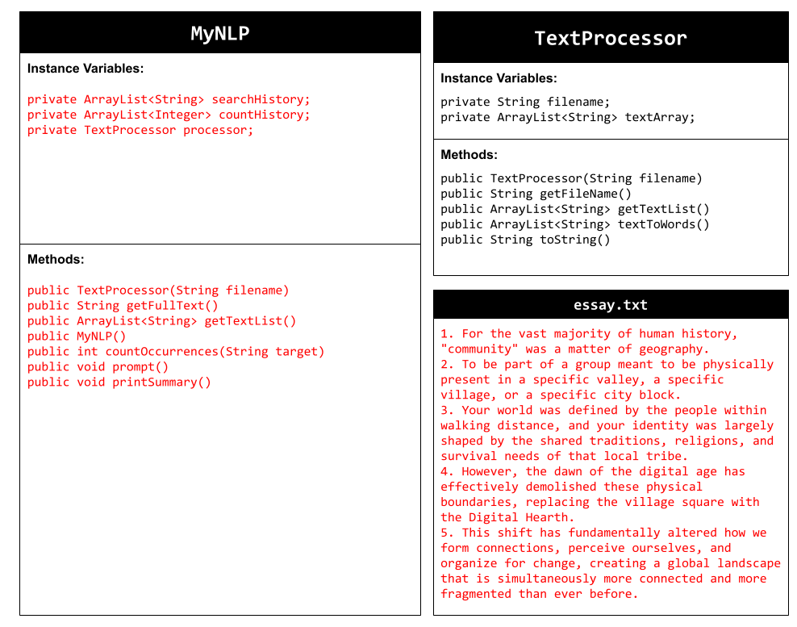
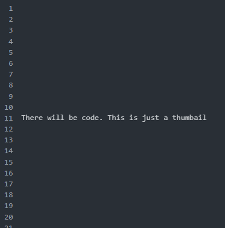

# Unit 6 - Natural Language Processing Project

## Introduction

Natural language processing (NLP) is used in many apps and devices to interact with users and make meaning of text to determine how to respond, find information, or to create new text. Your goal is to use natural language processing techniques to identify structure, patterns, and meaning in a text to have conversations with a user, execute commands, perform manipulations on the text, or generate new text.

## Requirements

Use your knowledge of object-oriented programming, ArrayLists, the String class, and algorithms to create a program that uses natural language processing techniques:

- **Create at least two ArrayLists** – Create at least two ArrayLists to store the data used in your program, such as data from text files or entered by the user.
- **Implement one or more algorithms** – Implement one or more algorithms that use loops and conditionals to find or manipulate elements in an ArrayList or String object.
- **Use methods in the String class** - Use one or more methods in the String class in your program, such as to divide text into sentences or phrases.
- **Use at least one natural language processing technique** – Use a natural language processing technique to process, analyze, and/or generate text.
- **Document your code** – Use comments to explain the purpose of the methods and code segments and note any preconditions and postconditions.

## UML Diagram

## Video

## Project Description

The goal of our application was to showcase how computers can use natural language processing. We had ai generate an essay or our choosing, and with user input; determine how many times their chosen word/phrase/letter shows up in the essay. The textfile is being read through and if there is a match, then we add one to a count.

## NLP Techniques

We created a simple method using text preprocessing. This preprocessing is an important early step in natural language processing. When we preprocess words or phrases from a file, we take the unstructured the data we get from it, layout that data in a (somewhat) structured manner to allow for subsequent analysis to be completed on it. In our case, we built a TextProcessor class, where the constructor reads from a text file, and places each line into an ArrayList so that we can easily retrieve, update and manipulate those characters. By using the combination of getFullText and getTextList (that provides all text for each line), we can accomplish both combining and manipulating (providing all lines in the same upper/lower case) raw text into a usable format.
